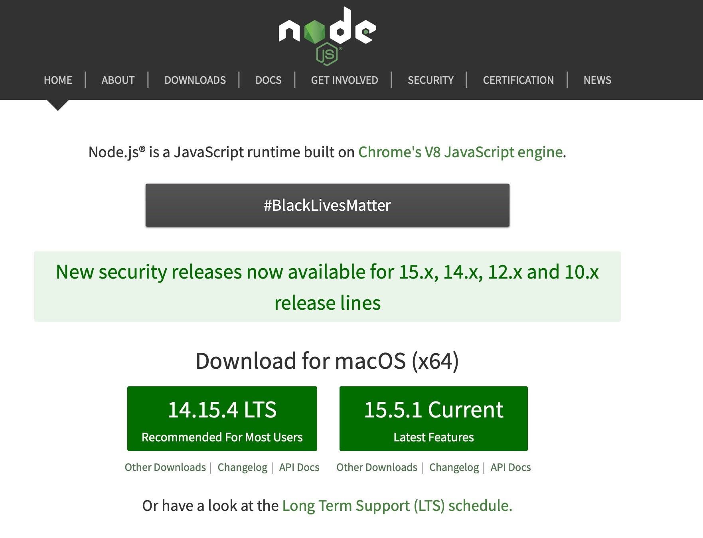
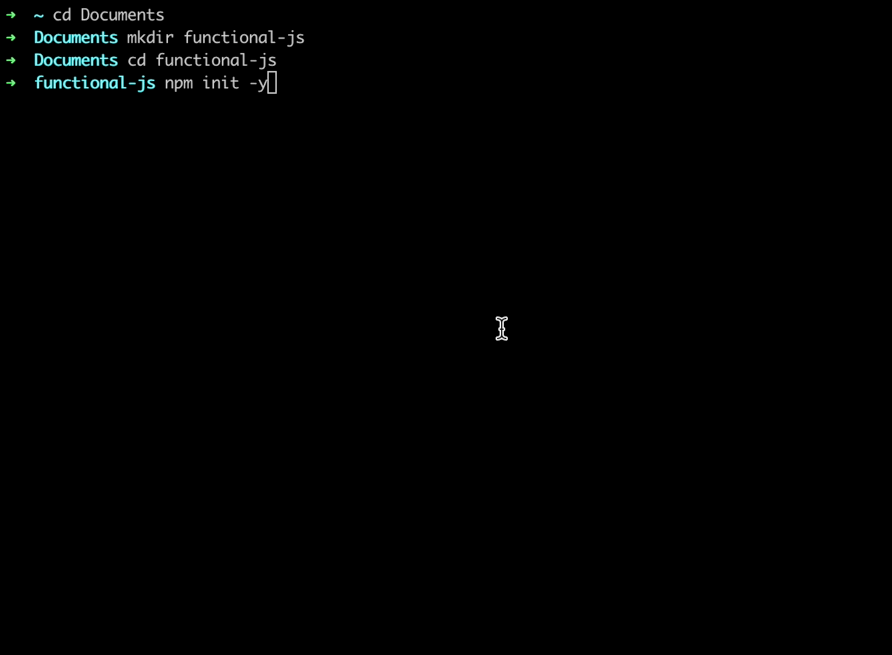
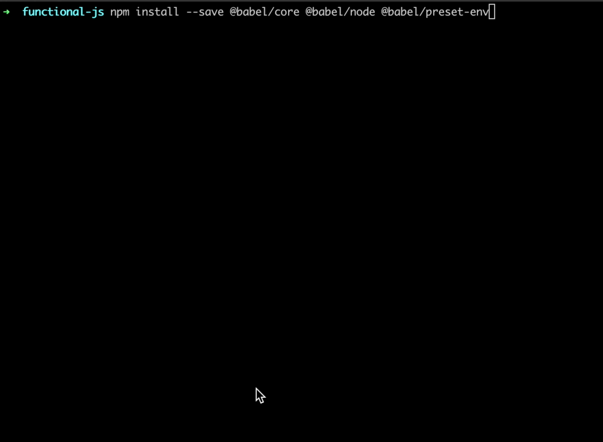

# Functional Programming - Set up the project
<!-- .slide: data-background="images/slides-headline-background.jpg" -->

## Install Node.js and npm

### Node.js

- Node.js is a platform that allows to run JavaScript code outside the browser
- You do not need a webpage

- [Download Node.js](https://nodejs.org/en/)



- Install Node.js

### NPM

- NPM is the node package manager. Let us install it.
- Open a terminal/console/cmd line
- Type `npm install -g npm@latest`
- On Linux/Mac could be that you need to do `sudo npm install -g npm@latest`
- Check with `npm -v` if you can see the version of your npm package installation
- Check with `node -v` if you can see your node.js version


### Set up the project

- open Terminal/Shell/Cmd
- create a folder, e.g. inside Documents folder
- `cd Documents`
- `mkdir functional-js`
- `cd functional-js`
- `npm init -y`



<!-- s -->

### ES6 support with babel

- Currently node JS does not support ES6 Javascript code syntax. (e.g. chrome supports it natively)
- therefore we need to install an npm package

- Type `npm install --save @babel/core @babel/node @babel/preset-env`



### Editor

- You can use the editor of your choice with JS syntax support but we recommend:
  - [Visual Studio Code](https://code.visualstudio.com/)

### Hello World "normal JS"

- open the folder you created in your editor
- Create a file called `hello-world.js` and put th efollowing content:

```javascript
function hello(name) {
    console.log("Hello " + name);
}

hello("Luke Skywalker");
```

- now open the Terminal inside Visual Studio Code in the menu bar with: >Terminal >Open Terminal
- Then type: `node hello-world.js`


- This is with normal Javascript syntax

### Hello World "ES6 syntax - arrow functions"

