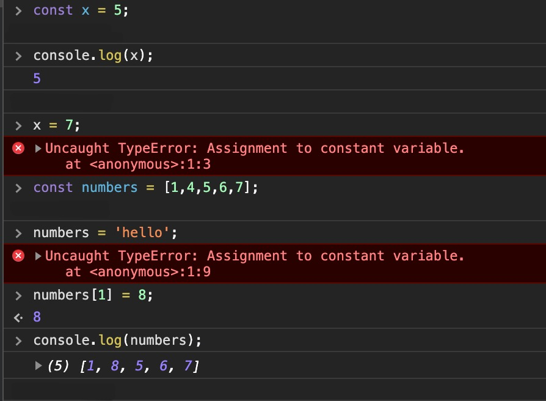

# Functional Programming - Basics

## What is Functional Programming?

> Functional programming is a programming paradigm a style of building the structure and elements of computer programs that treats computation as the evaluation of mathematical functions and avoids changing-state and mutable data -
*Wikipedia*
<!-- .element: class="fragment fade-up" -->

<!-- s -->

### Functional programming is

- a programming paradigma<!-- .element: class="fragment fade-up" -->
- mathematical functions<!-- .element: class="fragment fade-up" -->
- avoids changing-state<!-- .element: class="fragment fade-up" -->
- avoids mutable data<!-- .element: class="fragment fade-up" -->

<!-- .slide: data-background="https://media.giphy.com/media/3o7WIxxI7tLStjR2p2/giphy.gif" -->


<!-- s -->

## What is a function?

- Function has inputs and an output<!-- .element: class="fragment fade-up" -->

<!-- .element: class="fragment fade-up" -->

<!-- s -->

- Output (result) depends on the inputs (parameters)

Simple example: <!-- .element: class="fragment fade-up" -->

<!-- .element: class="fragment fade-up" -->

- 12 and 34 are inputs <!-- .element: class="fragment fade-up" -->
- the function sums (+)<!-- .element: class="fragment fade-up" -->
- 46 is the output<!-- .element: class="fragment fade-up" -->

<!-- s -->

Another example:

<!-- .element: class="fragment fade-up" -->

- a geometric object and 2 are inputs<!-- .element: class="fragment fade-up" -->
- the function is scaling<!-- .element: class="fragment fade-up" -->
- the output is a geometric object<!-- .element: class="fragment fade-up" -->

<!-- s -->

### Why Functional Programming?

- Object-oriented programming languages<!-- .element: class="fragment fade-up" -->
  - Java<!-- .element: class="fragment fade-up" -->
  - C++<!-- .element: class="fragment fade-up" -->
  - C#<!-- .element: class="fragment fade-up" -->
- difficult bug fixing<!-- .element: class="fragment fade-up" -->
- in enterprise usually thousands of variables<!-- .element: class="fragment fade-up" -->
- apps get into buggy state<!-- .element: class="fragment fade-up" -->

<!-- n -->

Applications in Object oriented languages reach pretty often very complex structure. They have relations and dependencies between a lot of different classes variables. Classes can and often have state variables and if bugs occur it is often hard to find and fix that. OO languages have ideas and concepts as well as best practices and testing to prevent bugs however it is still hard.
With functional programming applied bug fixing is more easy. Think of immutability of functions and variables. No "internal" state and separation of data and functions.

<!-- s -->

### Functional Programming

- uses some techniques to avoid buggy states<!-- .element: class="fragment fade-up" -->
  - smaller parts<!-- .element: class="fragment fade-up" -->
  - self-contained parts<!-- .element: class="fragment fade-up" -->
  - easily testable parts<!-- .element: class="fragment fade-up" -->
  - easily modifiable parts<!-- .element: class="fragment fade-up" -->

<!-- n -->

Object-oriented languages also try to organize the code in smaller, self-contained parts so that the code gets more easily testable and modifiable. However, often the success rate is not so high. 
So Functional Programming offers some other techniques for reaching that goal. By the way, most modern OO-languages also introduced functional programming (e.g. Java)

This is also a goal when programming in OO languages, but think of it, how often is that reached? Are abstractions/interfaces in a good way? How easy is it to write "good" and testable code in OO?
Functional programming techniques make it easier, as this is per se better testable if you apply it.

<!-- s -->

### Imperative vs Declarative

- What does a car consists of?<!-- .element: class="fragment fade-up" -->

vs.<!-- .element: class="fragment fade-up" -->

- How do I build a car?<!-- .element: class="fragment fade-up" -->

<!-- s -->

### How vs What

Imperative: HOW?<!-- .element: class="fragment fade-up" -->

Declarative: WHAT?<!-- .element: class="fragment fade-up" -->

<!-- n -->

An **imperative** way will describe all the steps - thus how are you going to do it where a **declarative** approach will describe what should happen.

<!-- s -->


### Imperative "HOW" example

> Sum of an array of numbers<!-- .element: class="fragment fade-up" -->

- Set x to zero<!-- .element: class="fragment fade-up" -->
- Add the first number in the array to x<!-- .element: class="fragment fade-up" -->
- Repeat previous step for the rest of the numbers in the array<!-- .element: class="fragment fade-up" -->

<!-- s -->

### Declarative "WHAT" example

> Sum of an array of numbers<!-- .element: class="fragment fade-up" -->

- X is the sum of all the numbers in the array<!-- .element: class="fragment fade-up" -->

🤔<!-- .element: class="fragment fade-up" -->

<!-- s -->

#### Imperative example

```javascript
function sumUp(numbers) {
  let x = numbers[0]; 
  for (let i = 1; i < numbers.length; i++){
    x += numbers[i];
  }
  return x;
};

sumUp([1,2,3]); // 6
```

<!-- s -->

#### Declarative example

```javascript
function sumUp(numbers) {
  return numbers.reduce((prev, current) => prev + current, 0)
}

sumUp([1,2,3]); // 6
```

<!-- n -->

Note that "under the hood" still declarative is used of course!!! We use the reduce() function. The most declarative solutions are an abstraction over some imperative implementation.

To be fair: you can reach that of course with OO too! Consider you have defined a method in your class with a declarative name, then you hide the algorithm deeper in you code by building abstractions! 

<!-- s -->

##### Even cooler declarative example

```javascript
const sumUp = numbers => numbers.reduce((prev, current) => prev + current, 0);

sumUp([1,2,3]); // 6
```
💪🏻<!-- .element: class="fragment fade-up" -->


<!-- s -->

## Core Concepts of Functional Programming

- Immutability<!-- .element: class="fragment fade-up" -->
- Separating functions and data<!-- .element: class="fragment fade-up" -->
- First-class functions<!-- .element: class="fragment fade-up" -->

<!-- s -->

### Immutability

#### Java<!-- .element: class="fragment fade-up" -->

```java
int x = 10; // initialize variable 
System.out.println(x); // prints 10

x = 100; // change value
System.out.println(x); // prints 100

x = -1; // change value again
System.out.println(x); // prints -1
```
<!-- .element: class="fragment fade-up" -->

<!-- s -->

#### Javascript

```javascript
var x = 10; // initialize variable 
console.log(x); // prints 10

x = 100; // change value
console.log(x); // prints 100

x = -1; // change value again
console.log(x); // prints -1
```
<!-- .element: class="fragment fade-up" -->

<!-- s -->

### Immutability in javascript

```javascript
var x = 10; // instead of var
let y = 10; // or let
```
<!-- .element: class="fragment fade-up" -->

```javascript
const x = 10; // use const keyword
```
<!-- .element: class="fragment fade-up" -->

`const`<!-- .element: class="fragment fade-up" -->

- keyword defines a constant which cannot be changed<!-- .element: class="fragment fade-up" -->

- In Java: <!-- .element: class="fragment fade-up" -->

`final`<!-- .element: class="fragment fade-up" -->

- variables cannot be changed!!!<!-- .element: class="fragment fade-up" -->

<!-- s -->

🤔

`x = 3` <!-- .element: class="fragment fade-up" -->

- literally means that x is 3<!-- .element: class="fragment fade-up" -->
- In OO you usually say that x is a container which can hold a value.<!-- .element: class="fragment fade-up" -->

`const pi = 3.14159` <!-- .element: class="fragment fade-up" -->

- literally means that pi is 3.14159<!-- .element: class="fragment fade-up" -->
- functional programming treats all values as constant (such as pi)<!-- .element: class="fragment fade-up" -->

- ➡ Never change a running sys... ehm initialized variable<!-- .element: class="fragment fade-up" -->

<!-- s -->

### Examples

#### Java<!-- .element: class="fragment fade-up" -->

```java
Employee employee1 = new Employee('Elon Musk', 70000);
employee1.raiseSalary (10000000000);
```
<!-- .element: class="fragment fade-up" -->

#### Javascript immutable example<!-- .element: class="fragment fade-up" -->

```javascript
const employee1 = {
  name: 'Elon Musk',
  salary: 70000,
};

const updatedEmployee1 = {
  name: employee1.name,
  salary: employee1.salary + 10000000000,
};

```
<!-- .element: class="fragment fade-up" -->

<!-- n -->

- Advantage is that we do not have to handle state changes.
- No change of reference variables like in other languages.
- e.g. in Java, passed by reference parameters!!! If you change the value of the passed parameter, you change the whole reference variable.
- Btw. to be fair, there are best practices in OO languages like Java to prevent this unwanted/unsecure behaviour, e.g. use unmodifiable Collections, make copies of variables and so forth.
- Generally, mutable variables can and often will lead to unwanted behaviour and bugs in your program.


<!-- s -->

## Separation of Data and Functions

### Data (as JSON)<!-- .element: class="fragment fade-up" -->

```javascript
  {
    "id": 43,
    "name": "OBAMA B",
    "birth_year": 1961,
    "years_served": 8,
    "party": "DEMOCRATIC",
  },
  {
    "id": 44,
    "name": "TRUMP D J",
    "birth_year": 1946,
    "years_served": 0,
    "party": "REPUBLICAN",
  }
```
<!-- .element: class="fragment fade-up" -->

<!-- s -->

### Even more data

```javascript
  {
    "pres_id": 43,
    "spouse_name": "ROBINSON M",
    "spouse_age": 28,
    "nr_children": 2,
    "marriage_year": 1992
  },
  {
    "pres_id": 44,
    "spouse_name": "ZELNICKOVA I",
    "spouse_age": 28,
    "nr_children": 3,
    "marriage_year": 1977
  },
```
<!-- .element: class="fragment fade-up" -->

<!-- s -->

> Data in Functional Programming is represented as simple arrays and hashes or (javascript) objects

<!-- s -->

### Functions

#### In object orientation<!-- .element: class="fragment fade-up" -->

**Java**<!-- .element: class="fragment fade-up" -->

```java
public class President {
  
  private String name;
  private int birth_year;
  private Spouse[] spouses;

  // ...

  public int getNumberOfSpouses() {   
      // ... 
  }
}
```
<!-- .element: class="fragment fade-up" -->

<!-- n -->

- Functions or methods are along with the data they belong to - inside classes.
- makes it easy to access as everything is in place

<!-- s -->

#### In functional programming

**Javascript**<!-- .element: class="fragment fade-up" -->

```javascript
const presidentsArray = [ ... ];

const spousesArray = [ ... ];

const findNumberOfSpouses = (president, spouses) => ({
    // ...
});

const numberOfSpouses = 
  findNumberOfSpouses(presidentsArray[41], spousesArray);
```
<!-- .element: class="fragment fade-up" -->

- functions and data separated<!-- .element: class="fragment fade-up" -->
- functions do not (cannot) change the data<!-- .element: class="fragment fade-up" -->
- functions return new data objects<!-- .element: class="fragment fade-up" -->

<!-- s -->

## First-class functions

> In computer science, a programming language is said to have first-class functions if it treats functions as first-class citizens. This means the language supports passing functions as arguments to other functions, returning them as the values from other functions, and assigning them to variables or storing them in data structures. - Wikipedia <!-- .element: class="fragment fade-up" -->

- In short, you can use functions as parameters and return values.<!-- .element: class="fragment fade-up" -->
- You can create arrays of functions<!-- .element: class="fragment fade-up" -->

<!-- s -->

### Example

```javascript
const arrayOfFunctions = [
   function doThis() { /* ... */ },
   function soThat() { /* ... */ },
];

doSomething(function sayHello() { /* ... */ });

// this is the non-arrow syntax of defining a function 
function giveMeAFunction() {
  return function() {
    console.log('I am a function');
  }
}
```
<!-- .element: class="fragment fade-up" -->

<!-- s -->

## Partial application

> partial application (or partial function application) refers to the process of fixing a number of arguments to a function, producing another function of smaller arity
<!-- .element: class="fragment" -->

- "transform" a function with argument to a function with less arguments<!-- .element: class="fragment" -->
- by "binding" an argument<!-- .element: class="fragment" -->

<!-- s -->

```javascript
const add = (x, y, z) => x + y + z;
```
<!-- .element: class="fragment fade-up" -->

```javascript
const addPartialOne = x => (y, z) => add(x, y, z);

const addTwo = addPartialOne(2);

const sum = addTwo(3,4)
```
<!-- .element: class="fragment fade-up" -->

<!-- s -->

### Why partial application?

- instead of passing all arguments in one place<!-- .element: class="fragment" -->
- pass "partially" the arguments in different places in your code<!-- .element: class="fragment" -->
- e.g. useful if you have a function which you use often with some same parameters<!-- .element: class="fragment" -->

<!-- s -->

## Currying

<!-- .slide: data-background="https://media.giphy.com/media/di2lDhmL74ysXx9eF5/giphy.gif" -->

<!-- s -->

> currying is the technique of converting a function that takes multiple arguments into a sequence of functions that each take a single argument.<!-- .element: class="fragment fade-up" -->

<!-- s -->

```javascript
const add = (x, y, z) => x + y + z;
const addPartialThree = x => y => z => add(x, y, z);

const add2 = addPartialThree(2); // returns a function with 1 parameter
const add5 = add2(5); // returns a function with 1 parameter
const sum = add5(8); // 15

const sumNicely = addPartialThree(2)(5)(8); // 15
```


<!-- s -->

## Some issues

- Javascript perfectly suits well for using functional programming 💪<!-- .element: class="fragment fade-up" -->
- However, Javascript is not a PURE functional programming language, like e.g. Haskell 😢<!-- .element: class="fragment fade-up" -->
- E.g. constants work well but do not totally ensure immutability, see: 🐛<!-- .element: class="fragment fade-up" -->


<!-- s -->



<!-- s -->

## Solution

- ESLint. We do not go into details, if you are interested:<!-- .element: class="fragment fade-up" -->

[jhusain/eslint-plugin-immutable: ESLint plugin to disable all mutation in JavaScript.](https://github.com/jhusain/eslint-plugin-immutable)<!-- .element: class="fragment fade-up" -->

- For more information see: <!-- .element: class="fragment fade-up" -->

[ESLint - Pluggable JavaScript linter](https://eslint.org/)<!-- .element: class="fragment fade-up" -->

<!-- s -->

## Exercises

The exercises are located in a template repository:

- [FontysVenlo/javascript-functional-exercises: Exercises for Functional Programming with Javascript](https://github.com/FontysVenlo/javascript-functional-exercises)<!-- .element: class="fragment fade-up" -->

- You get an invitation to a github classroom assignment with a copy of this repository<!-- .element: class="fragment fade-up" -->

> Exercises are not mandatory - BUT this is training for the assignments and will prepare you well<!-- .element: class="fragment fade-up" -->

<!-- s -->

## Links and Resources

### Free Javascript book

- [The JavaScript Beginner's Handbook](https://flaviocopes.com/page/javascript-handbook/)
- [The JavaScript from ES5 to ESNext Book](https://flaviocopes.com/page/es5-to-esnext/)

<!-- s -->

### General Javascript Tutorials

- [W3C Schools JavaScript Tutorial](https://www.w3schools.com/js/default.asp)
- [The Modern JavaScript Tutorial](https://javascript.info/)

<!-- s -->

### Videos

- [Functional Programming Basics In ES6 - YouTube](https://www.youtube.com/watch?v=FYXpOjwYzcs)
- [JavaScript Functional Programming Tutorial - YouTube](https://www.youtube.com/watch?v=6NPfQJJEySY)
- [Functional JavaScript Tutorial - E0: Intro - YouTube](https://www.youtube.com/watch?v=M4EyBg1dgas&list=PLhXZp00uXBk4ejkUZiDnv3R0AERA7Z4xp&index=1)
